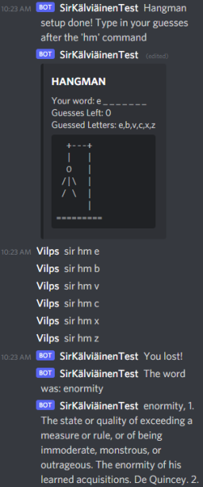

# Projects

Here are some other projects I've been a part of!

---

## Finnish Game Jam

I have been participating in Finnish Game Jams yearly since 2019. Checkout our previous projects here! Video Links open by clicking the images below. On the GGJ Site you can find source code and furhther information!

| Finnish Game Jam 22' | Finnish Game Jam 21' | Finnish Game Jam 20'|Finnish Game Jam 19'|
| :--: | :--: | :--: | :--: |
|Modifiers with you squids  |  AI Finds Your Child (Or Similar Enough)  |  The Raftening of The Caribbean 2: Electric Boogaloo  | Rush Home  |
|  <a href="https://globalgamejam.org/2022/games/modifiers-your-friends-8" target="_blank" rel="noreferrer">GGJ 22 Link</a> | <a href="https://v3.globalgamejam.org/2021/games/robot-battle-wheres-my-kid-1" target="_blank" rel="noreferrer">GGJ 21 Link</a> |<a href="https://v3.globalgamejam.org/2020/games/raft-game-9" target="_blank" rel="noreferrer">GGJ 20 Link</a>  |  <a href="https://v3.globalgamejam.org/2019/games/rush-home" target="_blank" rel="noreferrer">GGJ 19 Link</a> |
|  |  |  |  |

---

## Sir Kälviäinen

I've also got a Discord bot running, developed by the people on our own little server.
You can find the source code on <a href="https://github.com/petterigit/TheSir" target="_blank" rel="noreferrer">GitHub</a>!

It's filled with functionalities -- most of which have no apparent value to the them.. Here's a hangman game I made:

